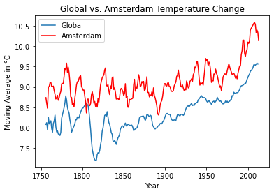
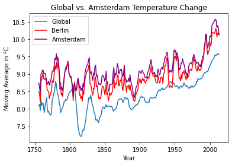
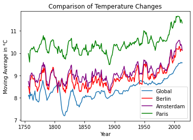

# Exploring Weather Trends 

## Join Database tables

- `city_data`
- `global_data`

### <h3 align="center" id="heading">Data Model</h3>
| year | country | city | avg_temp_city | avg_temp_global |
|------|---------|------|---------------|-----------------|
| INT  | CHAR    | CHAR | ENUM          | ENUM            |

```sql
-- RENAME column name from global_data, city_data
ALTER TABLE city_data
RENAME COLUMN avg_temp TO avg_temp_city;
ALTER TABLE global_data
RENAME COLUMN avg_temp TO avg_temp_global;

-- INNER JOIN global_data and city_data tables
SELECT city_data.year, city_data.country, city_data.city, city_data.avg_temp_city, global_data.avg_temp_global
FROM city_data
INNER JOIN global_data ON city_data.year=global_data.year ORDER BY city_data.year, city_data.country, city_data.city;
```


## 1. Import Libraries
To load new `pip` package from https://pypi.org, run the following line. `!pip install <package_name>`. You need to validate packages. Otherwise your environment may be infected with a virus. 


```python
import pandas as pd
import matplotlib.pyplot as plt
```

## 2. Extract
There are 3 datasets exists:
* **city_list**: This contains a list of cities and countries in the database. Look through them in order to find the city nearest to you.
* **city_data**: This contains the average temperatures for each city by year (ºC).
* **global_data**: This contains the average global temperatures by year (ºC).

I used pandas with `read_csv` function to extract csv to dataframe. Prefered to plot with `matplotlib`
* **cum_sum**: Cumulative summary of global temperature
* **count**: Indicates to nr. of years
* **mov_avg**: Moving average or rolling mean 


```python
df = pd.read_csv("../data/dataset.csv")
df
```


<div>
<style scoped>
    .dataframe tbody tr th:only-of-type {
        vertical-align: middle;
    }

    .dataframe tbody tr th {
        vertical-align: top;
    }

    .dataframe thead th {
        text-align: right;
    }
</style>
<table border="1" class="dataframe">
  <thead>
    <tr style="text-align: right;">
      <th></th>
      <th>year</th>
      <th>country</th>
      <th>city</th>
      <th>avg_temp_city</th>
      <th>avg_temp_global</th>
    </tr>
  </thead>
  <tbody>
    <tr>
      <th>0</th>
      <td>1750</td>
      <td>Albania</td>
      <td>Tirana</td>
      <td>15.91</td>
      <td>8.72</td>
    </tr>
    <tr>
      <th>1</th>
      <td>1750</td>
      <td>Austria</td>
      <td>Vienna</td>
      <td>8.86</td>
      <td>8.72</td>
    </tr>
    <tr>
      <th>2</th>
      <td>1750</td>
      <td>Belarus</td>
      <td>Minsk</td>
      <td>6.28</td>
      <td>8.72</td>
    </tr>
    <tr>
      <th>3</th>
      <td>1750</td>
      <td>Belgium</td>
      <td>Brussels</td>
      <td>10.73</td>
      <td>8.72</td>
    </tr>
    <tr>
      <th>4</th>
      <td>1750</td>
      <td>Bosnia And Herzegovina</td>
      <td>Sarajevo</td>
      <td>9.70</td>
      <td>8.72</td>
    </tr>
    <tr>
      <th>...</th>
      <td>...</td>
      <td>...</td>
      <td>...</td>
      <td>...</td>
      <td>...</td>
    </tr>
    <tr>
      <th>70234</th>
      <td>2013</td>
      <td>Venezuela</td>
      <td>Valencia</td>
      <td>26.60</td>
      <td>9.61</td>
    </tr>
    <tr>
      <th>70235</th>
      <td>2013</td>
      <td>Vietnam</td>
      <td>Hanoi</td>
      <td>23.10</td>
      <td>9.61</td>
    </tr>
    <tr>
      <th>70236</th>
      <td>2013</td>
      <td>Vietnam</td>
      <td>Ho Chi Minh City</td>
      <td>28.46</td>
      <td>9.61</td>
    </tr>
    <tr>
      <th>70237</th>
      <td>2013</td>
      <td>Zambia</td>
      <td>Lusaka</td>
      <td>20.14</td>
      <td>9.61</td>
    </tr>
    <tr>
      <th>70238</th>
      <td>2013</td>
      <td>Zimbabwe</td>
      <td>Harare</td>
      <td>19.76</td>
      <td>9.61</td>
    </tr>
  </tbody>
</table>
<p>70239 rows × 5 columns</p>
</div>


## 3. Exploration

### City filtered by Amsterdam 


```python
city_name = "Amsterdam"
df_ams = df.loc[df['city'] == city_name]
```


```python
df_ams
```


<div>
<style scoped>
    .dataframe tbody tr th:only-of-type {
        vertical-align: middle;
    }

    .dataframe tbody tr th {
        vertical-align: top;
    }

    .dataframe thead th {
        text-align: right;
    }
</style>
<table border="1" class="dataframe">
  <thead>
    <tr style="text-align: right;">
      <th></th>
      <th>year</th>
      <th>country</th>
      <th>city</th>
      <th>avg_temp_city</th>
      <th>avg_temp_global</th>
    </tr>
  </thead>
  <tbody>
    <tr>
      <th>29</th>
      <td>1750</td>
      <td>Netherlands</td>
      <td>Amsterdam</td>
      <td>10.04</td>
      <td>8.72</td>
    </tr>
    <tr>
      <th>108</th>
      <td>1751</td>
      <td>Netherlands</td>
      <td>Amsterdam</td>
      <td>9.63</td>
      <td>7.98</td>
    </tr>
    <tr>
      <th>187</th>
      <td>1752</td>
      <td>Netherlands</td>
      <td>Amsterdam</td>
      <td>5.97</td>
      <td>5.78</td>
    </tr>
    <tr>
      <th>271</th>
      <td>1753</td>
      <td>Netherlands</td>
      <td>Amsterdam</td>
      <td>9.08</td>
      <td>8.39</td>
    </tr>
    <tr>
      <th>357</th>
      <td>1754</td>
      <td>Netherlands</td>
      <td>Amsterdam</td>
      <td>8.72</td>
      <td>8.47</td>
    </tr>
    <tr>
      <th>...</th>
      <td>...</td>
      <td>...</td>
      <td>...</td>
      <td>...</td>
      <td>...</td>
    </tr>
    <tr>
      <th>68726</th>
      <td>2009</td>
      <td>Netherlands</td>
      <td>Amsterdam</td>
      <td>10.33</td>
      <td>9.51</td>
    </tr>
    <tr>
      <th>69068</th>
      <td>2010</td>
      <td>Netherlands</td>
      <td>Amsterdam</td>
      <td>8.84</td>
      <td>9.70</td>
    </tr>
    <tr>
      <th>69410</th>
      <td>2011</td>
      <td>Netherlands</td>
      <td>Amsterdam</td>
      <td>10.73</td>
      <td>9.52</td>
    </tr>
    <tr>
      <th>69752</th>
      <td>2012</td>
      <td>Netherlands</td>
      <td>Amsterdam</td>
      <td>10.08</td>
      <td>9.51</td>
    </tr>
    <tr>
      <th>70094</th>
      <td>2013</td>
      <td>Netherlands</td>
      <td>Amsterdam</td>
      <td>9.54</td>
      <td>9.61</td>
    </tr>
  </tbody>
</table>
<p>264 rows × 5 columns</p>
</div>


### Moving Average

Moving average, i.e. rolling average, is used for calculating averages of window groups indeed having a smoother line to visualise trends better rather than seasonal effects.


```python
year = df_ams['year']
global_temp_ma =  df_ams['avg_temp_global'].rolling(7).mean()
ams_temp_ma =  df_ams['avg_temp_city'].rolling(7).mean()

df_ams = df_ams.assign(ma_global = global_temp_ma.values, ma_amsterdam = ams_temp_ma.values)
```


```python
df_ams
```


<div>
<style scoped>
    .dataframe tbody tr th:only-of-type {
        vertical-align: middle;
    }

    .dataframe tbody tr th {
        vertical-align: top;
    }

    .dataframe thead th {
        text-align: right;
    }
</style>
<table border="1" class="dataframe">
  <thead>
    <tr style="text-align: right;">
      <th></th>
      <th>year</th>
      <th>country</th>
      <th>city</th>
      <th>avg_temp_city</th>
      <th>avg_temp_global</th>
      <th>ma_global</th>
      <th>ma_amsterdam</th>
    </tr>
  </thead>
  <tbody>
    <tr>
      <th>29</th>
      <td>1750</td>
      <td>Netherlands</td>
      <td>Amsterdam</td>
      <td>10.04</td>
      <td>8.72</td>
      <td>NaN</td>
      <td>NaN</td>
    </tr>
    <tr>
      <th>108</th>
      <td>1751</td>
      <td>Netherlands</td>
      <td>Amsterdam</td>
      <td>9.63</td>
      <td>7.98</td>
      <td>NaN</td>
      <td>NaN</td>
    </tr>
    <tr>
      <th>187</th>
      <td>1752</td>
      <td>Netherlands</td>
      <td>Amsterdam</td>
      <td>5.97</td>
      <td>5.78</td>
      <td>NaN</td>
      <td>NaN</td>
    </tr>
    <tr>
      <th>271</th>
      <td>1753</td>
      <td>Netherlands</td>
      <td>Amsterdam</td>
      <td>9.08</td>
      <td>8.39</td>
      <td>NaN</td>
      <td>NaN</td>
    </tr>
    <tr>
      <th>357</th>
      <td>1754</td>
      <td>Netherlands</td>
      <td>Amsterdam</td>
      <td>8.72</td>
      <td>8.47</td>
      <td>NaN</td>
      <td>NaN</td>
    </tr>
    <tr>
      <th>...</th>
      <td>...</td>
      <td>...</td>
      <td>...</td>
      <td>...</td>
      <td>...</td>
      <td>...</td>
      <td>...</td>
    </tr>
    <tr>
      <th>68726</th>
      <td>2009</td>
      <td>Netherlands</td>
      <td>Amsterdam</td>
      <td>10.33</td>
      <td>9.51</td>
      <td>9.535714</td>
      <td>10.541429</td>
    </tr>
    <tr>
      <th>69068</th>
      <td>2010</td>
      <td>Netherlands</td>
      <td>Amsterdam</td>
      <td>8.84</td>
      <td>9.70</td>
      <td>9.560000</td>
      <td>10.335714</td>
    </tr>
    <tr>
      <th>69410</th>
      <td>2011</td>
      <td>Netherlands</td>
      <td>Amsterdam</td>
      <td>10.73</td>
      <td>9.52</td>
      <td>9.588571</td>
      <td>10.401429</td>
    </tr>
    <tr>
      <th>69752</th>
      <td>2012</td>
      <td>Netherlands</td>
      <td>Amsterdam</td>
      <td>10.08</td>
      <td>9.51</td>
      <td>9.561429</td>
      <td>10.344286</td>
    </tr>
    <tr>
      <th>70094</th>
      <td>2013</td>
      <td>Netherlands</td>
      <td>Amsterdam</td>
      <td>9.54</td>
      <td>9.61</td>
      <td>9.572857</td>
      <td>10.140000</td>
    </tr>
  </tbody>
</table>
<p>264 rows × 7 columns</p>
</div>


## 4. Visualisation

The line is the best chart to observe a time series data. In this way, trends and movement directions can be clearly tracked. 


```python
plt.plot(year, global_temp_ma, label="Global")
plt.plot(year, ams_temp_ma, label="Amsterdam", color="red")
plt.legend()
plt.title( 'Comparison of Temperature Changes')
plt.xlabel ('Year')
plt.ylabel('Moving Average in °C')
plt.show()
```


    

    


*The graph shows the moving average of temperature changes in globe and Amsterdam, between 1750 and 2013. 
According to the graph, the years 1750 to 1800 saw the MA of temperatures in globe and Amsterdam increase and decrease by approximately the same directions. However, when global MAs reflect an overall increasing trend except for middle 1800s, Amsterdam MAs has quick and sharp up and downs compared to global ones. Also, it’s clearly seen that in Amsterdam, MA of temperatures are always above the global rates expect for the early 1800s. So that, Amsterdam is hotter compared to the global average. 
As overall, the world consistently getting hotter since the late 1850s.*


```python
city_name = "Berlin"
df_berlin = df.loc[df['city'] == city_name]
```


```python
df_berlin
```


<div>
<style scoped>
    .dataframe tbody tr th:only-of-type {
        vertical-align: middle;
    }

    .dataframe tbody tr th {
        vertical-align: top;
    }

    .dataframe thead th {
        text-align: right;
    }
</style>
<table border="1" class="dataframe">
  <thead>
    <tr style="text-align: right;">
      <th></th>
      <th>year</th>
      <th>country</th>
      <th>city</th>
      <th>avg_temp_city</th>
      <th>avg_temp_global</th>
    </tr>
  </thead>
  <tbody>
    <tr>
      <th>17</th>
      <td>1750</td>
      <td>Germany</td>
      <td>Berlin</td>
      <td>9.83</td>
      <td>8.72</td>
    </tr>
    <tr>
      <th>96</th>
      <td>1751</td>
      <td>Germany</td>
      <td>Berlin</td>
      <td>9.75</td>
      <td>7.98</td>
    </tr>
    <tr>
      <th>175</th>
      <td>1752</td>
      <td>Germany</td>
      <td>Berlin</td>
      <td>4.84</td>
      <td>5.78</td>
    </tr>
    <tr>
      <th>255</th>
      <td>1753</td>
      <td>Germany</td>
      <td>Berlin</td>
      <td>8.72</td>
      <td>8.39</td>
    </tr>
    <tr>
      <th>341</th>
      <td>1754</td>
      <td>Germany</td>
      <td>Berlin</td>
      <td>8.49</td>
      <td>8.47</td>
    </tr>
    <tr>
      <th>...</th>
      <td>...</td>
      <td>...</td>
      <td>...</td>
      <td>...</td>
      <td>...</td>
    </tr>
    <tr>
      <th>68637</th>
      <td>2009</td>
      <td>Germany</td>
      <td>Berlin</td>
      <td>10.06</td>
      <td>9.51</td>
    </tr>
    <tr>
      <th>68979</th>
      <td>2010</td>
      <td>Germany</td>
      <td>Berlin</td>
      <td>8.61</td>
      <td>9.70</td>
    </tr>
    <tr>
      <th>69321</th>
      <td>2011</td>
      <td>Germany</td>
      <td>Berlin</td>
      <td>10.56</td>
      <td>9.52</td>
    </tr>
    <tr>
      <th>69663</th>
      <td>2012</td>
      <td>Germany</td>
      <td>Berlin</td>
      <td>9.96</td>
      <td>9.51</td>
    </tr>
    <tr>
      <th>70005</th>
      <td>2013</td>
      <td>Germany</td>
      <td>Berlin</td>
      <td>10.12</td>
      <td>9.61</td>
    </tr>
  </tbody>
</table>
<p>264 rows × 5 columns</p>
</div>


```python
year = df_berlin['year']
global_temp_ma =  df_berlin['avg_temp_global'].rolling(7).mean()
berlin_temp_ma =  df_berlin['avg_temp_city'].rolling(7).mean()

df_berlin = df_berlin.assign(ma_global = global_temp_ma.values, ma_berlin = berlin_temp_ma.values)
```


```python
plt.plot(year, global_temp_ma, label="Global")
plt.plot(year, berlin_temp_ma, label="Berlin", color="red")
plt.plot(year, ams_temp_ma, label="Amsterdam", color="purple")
plt.legend()
plt.title( 'Comparison of Temperature Changes')
plt.xlabel ('Year')
plt.ylabel('Moving Average in °C')
plt.show()
```


    

    


```python
city_name = "Paris"
df_paris = df.loc[df['city'] == city_name]
```


```python
df_paris
```


<div>
<style scoped>
    .dataframe tbody tr th:only-of-type {
        vertical-align: middle;
    }

    .dataframe tbody tr th {
        vertical-align: top;
    }

    .dataframe thead th {
        text-align: right;
    }
</style>
<table border="1" class="dataframe">
  <thead>
    <tr style="text-align: right;">
      <th></th>
      <th>year</th>
      <th>country</th>
      <th>city</th>
      <th>avg_temp_city</th>
      <th>avg_temp_global</th>
    </tr>
  </thead>
  <tbody>
    <tr>
      <th>16</th>
      <td>1750</td>
      <td>France</td>
      <td>Paris</td>
      <td>11.18</td>
      <td>8.72</td>
    </tr>
    <tr>
      <th>95</th>
      <td>1751</td>
      <td>France</td>
      <td>Paris</td>
      <td>11.15</td>
      <td>7.98</td>
    </tr>
    <tr>
      <th>174</th>
      <td>1752</td>
      <td>France</td>
      <td>Paris</td>
      <td>6.97</td>
      <td>5.78</td>
    </tr>
    <tr>
      <th>254</th>
      <td>1753</td>
      <td>France</td>
      <td>Paris</td>
      <td>10.40</td>
      <td>8.39</td>
    </tr>
    <tr>
      <th>340</th>
      <td>1754</td>
      <td>France</td>
      <td>Paris</td>
      <td>10.15</td>
      <td>8.47</td>
    </tr>
    <tr>
      <th>...</th>
      <td>...</td>
      <td>...</td>
      <td>...</td>
      <td>...</td>
      <td>...</td>
    </tr>
    <tr>
      <th>68634</th>
      <td>2009</td>
      <td>France</td>
      <td>Paris</td>
      <td>11.46</td>
      <td>9.51</td>
    </tr>
    <tr>
      <th>68976</th>
      <td>2010</td>
      <td>France</td>
      <td>Paris</td>
      <td>10.41</td>
      <td>9.70</td>
    </tr>
    <tr>
      <th>69318</th>
      <td>2011</td>
      <td>France</td>
      <td>Paris</td>
      <td>12.33</td>
      <td>9.52</td>
    </tr>
    <tr>
      <th>69660</th>
      <td>2012</td>
      <td>France</td>
      <td>Paris</td>
      <td>11.22</td>
      <td>9.51</td>
    </tr>
    <tr>
      <th>70002</th>
      <td>2013</td>
      <td>France</td>
      <td>Paris</td>
      <td>11.01</td>
      <td>9.61</td>
    </tr>
  </tbody>
</table>
<p>264 rows × 5 columns</p>
</div>


```python
year = df_paris['year']
global_temp_ma =  df_paris['avg_temp_global'].rolling(7).mean()
paris_temp_ma =  df_paris['avg_temp_city'].rolling(7).mean()

df_paris =df_paris.assign(ma_global = global_temp_ma.values, ma_paris = paris_temp_ma.values)
```


```python
df_paris
```


<div>
<style scoped>
    .dataframe tbody tr th:only-of-type {
        vertical-align: middle;
    }

    .dataframe tbody tr th {
        vertical-align: top;
    }

    .dataframe thead th {
        text-align: right;
    }
</style>
<table border="1" class="dataframe">
  <thead>
    <tr style="text-align: right;">
      <th></th>
      <th>year</th>
      <th>country</th>
      <th>city</th>
      <th>avg_temp_city</th>
      <th>avg_temp_global</th>
      <th>ma_global</th>
      <th>ma_paris</th>
    </tr>
  </thead>
  <tbody>
    <tr>
      <th>16</th>
      <td>1750</td>
      <td>France</td>
      <td>Paris</td>
      <td>11.18</td>
      <td>8.72</td>
      <td>NaN</td>
      <td>NaN</td>
    </tr>
    <tr>
      <th>95</th>
      <td>1751</td>
      <td>France</td>
      <td>Paris</td>
      <td>11.15</td>
      <td>7.98</td>
      <td>NaN</td>
      <td>NaN</td>
    </tr>
    <tr>
      <th>174</th>
      <td>1752</td>
      <td>France</td>
      <td>Paris</td>
      <td>6.97</td>
      <td>5.78</td>
      <td>NaN</td>
      <td>NaN</td>
    </tr>
    <tr>
      <th>254</th>
      <td>1753</td>
      <td>France</td>
      <td>Paris</td>
      <td>10.40</td>
      <td>8.39</td>
      <td>NaN</td>
      <td>NaN</td>
    </tr>
    <tr>
      <th>340</th>
      <td>1754</td>
      <td>France</td>
      <td>Paris</td>
      <td>10.15</td>
      <td>8.47</td>
      <td>NaN</td>
      <td>NaN</td>
    </tr>
    <tr>
      <th>...</th>
      <td>...</td>
      <td>...</td>
      <td>...</td>
      <td>...</td>
      <td>...</td>
      <td>...</td>
      <td>...</td>
    </tr>
    <tr>
      <th>68634</th>
      <td>2009</td>
      <td>France</td>
      <td>Paris</td>
      <td>11.46</td>
      <td>9.51</td>
      <td>9.535714</td>
      <td>11.582857</td>
    </tr>
    <tr>
      <th>68976</th>
      <td>2010</td>
      <td>France</td>
      <td>Paris</td>
      <td>10.41</td>
      <td>9.70</td>
      <td>9.560000</td>
      <td>11.368571</td>
    </tr>
    <tr>
      <th>69318</th>
      <td>2011</td>
      <td>France</td>
      <td>Paris</td>
      <td>12.33</td>
      <td>9.52</td>
      <td>9.588571</td>
      <td>11.510000</td>
    </tr>
    <tr>
      <th>69660</th>
      <td>2012</td>
      <td>France</td>
      <td>Paris</td>
      <td>11.22</td>
      <td>9.51</td>
      <td>9.561429</td>
      <td>11.462857</td>
    </tr>
    <tr>
      <th>70002</th>
      <td>2013</td>
      <td>France</td>
      <td>Paris</td>
      <td>11.01</td>
      <td>9.61</td>
      <td>9.572857</td>
      <td>11.351429</td>
    </tr>
  </tbody>
</table>
<p>264 rows × 7 columns</p>
</div>


```python
plt.plot(year, global_temp_ma, label="Global")
plt.plot(year, berlin_temp_ma, label="Berlin", color="red")
plt.plot(year, ams_temp_ma, label="Amsterdam", color="purple")
plt.plot(year, paris_temp_ma, label="Paris", color="green")
plt.legend()
plt.title( 'Comparison of Temperature Changes')
plt.xlabel ('Year')
plt.ylabel('Moving Average in °C')
plt.show()
```


    

    


```python
city_name = "Istanbul"
df_istanbul = df.loc[df['city'] == city_name]
```


```python
df_istanbul
```


<div>
<style scoped>
    .dataframe tbody tr th:only-of-type {
        vertical-align: middle;
    }

    .dataframe tbody tr th {
        vertical-align: top;
    }

    .dataframe thead th {
        text-align: right;
    }
</style>
<table border="1" class="dataframe">
  <thead>
    <tr style="text-align: right;">
      <th></th>
      <th>year</th>
      <th>country</th>
      <th>city</th>
      <th>avg_temp_city</th>
      <th>avg_temp_global</th>
    </tr>
  </thead>
  <tbody>
    <tr>
      <th>50</th>
      <td>1750</td>
      <td>Turkey</td>
      <td>Istanbul</td>
      <td>13.83</td>
      <td>8.72</td>
    </tr>
    <tr>
      <th>129</th>
      <td>1751</td>
      <td>Turkey</td>
      <td>Istanbul</td>
      <td>14.14</td>
      <td>7.98</td>
    </tr>
    <tr>
      <th>208</th>
      <td>1752</td>
      <td>Turkey</td>
      <td>Istanbul</td>
      <td>9.48</td>
      <td>5.78</td>
    </tr>
    <tr>
      <th>293</th>
      <td>1753</td>
      <td>Turkey</td>
      <td>Istanbul</td>
      <td>13.42</td>
      <td>8.39</td>
    </tr>
    <tr>
      <th>379</th>
      <td>1754</td>
      <td>Turkey</td>
      <td>Istanbul</td>
      <td>13.58</td>
      <td>8.47</td>
    </tr>
    <tr>
      <th>...</th>
      <td>...</td>
      <td>...</td>
      <td>...</td>
      <td>...</td>
      <td>...</td>
    </tr>
    <tr>
      <th>68798</th>
      <td>2009</td>
      <td>Turkey</td>
      <td>Istanbul</td>
      <td>14.95</td>
      <td>9.51</td>
    </tr>
    <tr>
      <th>69140</th>
      <td>2010</td>
      <td>Turkey</td>
      <td>Istanbul</td>
      <td>15.60</td>
      <td>9.70</td>
    </tr>
    <tr>
      <th>69482</th>
      <td>2011</td>
      <td>Turkey</td>
      <td>Istanbul</td>
      <td>13.65</td>
      <td>9.52</td>
    </tr>
    <tr>
      <th>69824</th>
      <td>2012</td>
      <td>Turkey</td>
      <td>Istanbul</td>
      <td>14.97</td>
      <td>9.51</td>
    </tr>
    <tr>
      <th>70166</th>
      <td>2013</td>
      <td>Turkey</td>
      <td>Istanbul</td>
      <td>16.02</td>
      <td>9.61</td>
    </tr>
  </tbody>
</table>
<p>264 rows × 5 columns</p>
</div>


```python
year = df_istanbul['year']
global_temp_ma = df_istanbul['avg_temp_global'].rolling(7).mean()
istanbul_temp_ma = df_istanbul['avg_temp_city'].rolling(7).mean()
df_istanbul = df_istanbul.assign(ma_global = global_temp_ma.values, ma_istanbul = istanbul_temp_ma.values)
```


```python
df_istanbul
```


<div>
<style scoped>
    .dataframe tbody tr th:only-of-type {
        vertical-align: middle;
    }

    .dataframe tbody tr th {
        vertical-align: top;
    }

    .dataframe thead th {
        text-align: right;
    }
</style>
<table border="1" class="dataframe">
  <thead>
    <tr style="text-align: right;">
      <th></th>
      <th>year</th>
      <th>country</th>
      <th>city</th>
      <th>avg_temp_city</th>
      <th>avg_temp_global</th>
      <th>ma_global</th>
      <th>ma_istanbul</th>
    </tr>
  </thead>
  <tbody>
    <tr>
      <th>50</th>
      <td>1750</td>
      <td>Turkey</td>
      <td>Istanbul</td>
      <td>13.83</td>
      <td>8.72</td>
      <td>NaN</td>
      <td>NaN</td>
    </tr>
    <tr>
      <th>129</th>
      <td>1751</td>
      <td>Turkey</td>
      <td>Istanbul</td>
      <td>14.14</td>
      <td>7.98</td>
      <td>NaN</td>
      <td>NaN</td>
    </tr>
    <tr>
      <th>208</th>
      <td>1752</td>
      <td>Turkey</td>
      <td>Istanbul</td>
      <td>9.48</td>
      <td>5.78</td>
      <td>NaN</td>
      <td>NaN</td>
    </tr>
    <tr>
      <th>293</th>
      <td>1753</td>
      <td>Turkey</td>
      <td>Istanbul</td>
      <td>13.42</td>
      <td>8.39</td>
      <td>NaN</td>
      <td>NaN</td>
    </tr>
    <tr>
      <th>379</th>
      <td>1754</td>
      <td>Turkey</td>
      <td>Istanbul</td>
      <td>13.58</td>
      <td>8.47</td>
      <td>NaN</td>
      <td>NaN</td>
    </tr>
    <tr>
      <th>...</th>
      <td>...</td>
      <td>...</td>
      <td>...</td>
      <td>...</td>
      <td>...</td>
      <td>...</td>
      <td>...</td>
    </tr>
    <tr>
      <th>68798</th>
      <td>2009</td>
      <td>Turkey</td>
      <td>Istanbul</td>
      <td>14.95</td>
      <td>9.51</td>
      <td>9.535714</td>
      <td>14.474286</td>
    </tr>
    <tr>
      <th>69140</th>
      <td>2010</td>
      <td>Turkey</td>
      <td>Istanbul</td>
      <td>15.60</td>
      <td>9.70</td>
      <td>9.560000</td>
      <td>14.715714</td>
    </tr>
    <tr>
      <th>69482</th>
      <td>2011</td>
      <td>Turkey</td>
      <td>Istanbul</td>
      <td>13.65</td>
      <td>9.52</td>
      <td>9.588571</td>
      <td>14.632857</td>
    </tr>
    <tr>
      <th>69824</th>
      <td>2012</td>
      <td>Turkey</td>
      <td>Istanbul</td>
      <td>14.97</td>
      <td>9.51</td>
      <td>9.561429</td>
      <td>14.738571</td>
    </tr>
    <tr>
      <th>70166</th>
      <td>2013</td>
      <td>Turkey</td>
      <td>Istanbul</td>
      <td>16.02</td>
      <td>9.61</td>
      <td>9.572857</td>
      <td>15.011429</td>
    </tr>
  </tbody>
</table>
<p>264 rows × 7 columns</p>
</div>


```python
plt.plot(year, global_temp_ma, label="Global", color="darkorange")
plt.plot(year, istanbul_temp_ma, label="Istanbul", color="red")
plt.plot(year, berlin_temp_ma, label="Berlin", color="blue")
plt.plot(year, ams_temp_ma, label="Amsterdam", color="purple")
plt.plot(year, paris_temp_ma, label="Paris", color="green")
plt.legend()
plt.title( 'Comparison of Temperature Changes')
plt.xlabel ('Year')
plt.ylabel('Moving Average in °C')
plt.show()
```


    

    


*The Comparison of Temperature Changes graph displays 5 rolling averages as Istanbul, Berlin, Amsterdam, Paris and Global.
As Istanbul is the hottest city, Paris follows her. Althoug, Berlin is colder than Amsterdam, they is a strong pozitif correlation between them.*

